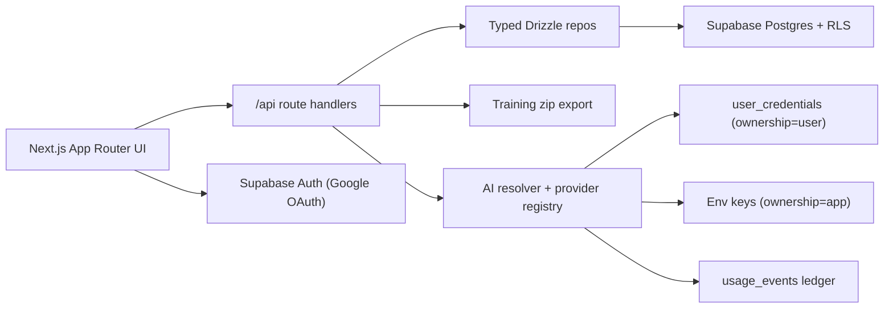

# lexi

A personal writing workspace built around one idea: the friction between drafting and getting AI help is the thing slowing you down. Lexi puts both surfaces in the same document so a rewrite is a selection and a keystroke, not a copy-paste round-trip to a chat window.

The MVP ships one core transform — the **Rewrite Strip** — and a background **Style Profile** (preferences, exemplars, before/after pairs) that the AI uses to keep your voice consistent. The same data model is ready for additional transforms, hosted billing, and agent workflows without a schema change.

> _Demo gif placeholder — record a 10–20s screen capture showing: select a sentence → press `Mod+R` → AI suggestion appears in the strip → accept → repeat on the next sentence._

## Why this exists

I built lexi for myself, for two reasons:

1. **Daily-driver workflow.** I write a lot, and the worst part of writing-with-AI is the bottleneck between the surface I write on and the surface I prompt on. Lexi collapses them.
2. **Portfolio piece.** Most product work is about shipping for users. This one is about building a custom AI workflow for myself — the kind of internal tool a PM should be able to spec, build, and live in.

The repo is **source-available under FSL-1.1-MIT** (see [LICENSE.md](./LICENSE.md)) — fork it, run it locally, deploy your own instance with your own keys. After two years it converts to MIT.

## Architecture



Stack: Next.js 14 (App Router) · TypeScript · Supabase (Auth + Postgres + RLS) · Drizzle ORM · TipTap · Tailwind · Vercel AI SDK (Anthropic + OpenAI).

## Run your own

### 1. Supabase

1. Create a Supabase project.
2. Enable Google OAuth in Auth settings, add your callback URL: `<your-app-url>/auth/callback`.
3. Apply migrations in order: `supabase/migrations/0001_init.sql`, then `supabase/migrations/0002_usage_events_ownership.sql`.

### 2. Local

```bash
pnpm install
cp .env.example .env.local
# fill NEXT_PUBLIC_SUPABASE_URL, NEXT_PUBLIC_SUPABASE_ANON_KEY,
# NEXT_PUBLIC_APP_URL, DATABASE_URL — and either ANTHROPIC_API_KEY or
# OPENAI_API_KEY (or add a personal key in Settings after signing in)
pnpm dev
```

### 3. Deploy to Vercel

Connect your fork to Vercel and set the same env vars in the project dashboard. If you want the deployment to be effectively single-tenant (just you), set `LEXI_ALLOWED_EMAILS` to your Google address — anyone else who signs in is rejected and pointed back at the README.

### Environment variables

| Variable | Purpose |
| --- | --- |
| `NEXT_PUBLIC_SUPABASE_URL`, `NEXT_PUBLIC_SUPABASE_ANON_KEY` | Supabase client |
| `SUPABASE_SERVICE_ROLE_KEY` | Server-side admin (used sparingly) |
| `NEXT_PUBLIC_APP_URL` | OAuth callback origin |
| `DATABASE_URL` | Drizzle Postgres connection |
| `ANTHROPIC_API_KEY` / `OPENAI_API_KEY` | Optional server-side AI fallback for users without BYOK keys |
| `LEXI_DEFAULT_AI_PROVIDER` | `anthropic` (default) or `openai` |
| `LEXI_ALLOWED_EMAILS` | Comma-separated allowlist. Unset = open BYOK fork. Set = single-tenant lock. |
| `LEXI_RATE_LIMIT_ALLOWLIST_EMAILS` | Operator emails that bypass MVP rate limits |

## Extending

### Add a transform

Transforms are declared in `src/lib/transforms/types.ts` and registered in `src/lib/transforms/registry.ts`. The Rewrite Strip in `src/lib/transforms/rewrite.ts` is the reference implementation.

Keep transform data pure: selection, document text, document type, voice context, and user id flow through `TransformContext`. UI transforms delegate to editor/controller code and return a `TransformResult` only after the user commits. Every committed transform that changes prose should seed a style event with before/after text and context so the Style Profile stays useful.

### Add an AI provider

Provider contracts live in `src/lib/ai/types.ts`. The resolver loads BYOK credentials from `user_credentials`, instantiates the provider factory, and wraps successful calls with `recordUsageEvent()`.

Use `src/lib/ai/providers/anthropic.ts` as the scaffold. Anthropic cached system blocks are wired via `cacheControl: { type: "ephemeral" }`; OpenAI follows the same interface without cache-specific metadata.

### Add a renderer mode

Rewrite rendering is shared through `RewriteStripProvider` in `src/components/editor/extensions/RewriteStrip/controller.tsx`. New modes consume the same session state and call the same `commit`, `cancel`, and `setAutoAdvance` actions.

`InlineStripRenderer.tsx` is the feature-complete reference; `SidePanelRenderer.tsx` and `OverlayModalRenderer.tsx` show how to attach alternate UI while keeping the data path identical.

## Data model

| Table | What it holds |
| --- | --- |
| `projects` | Optional organization buckets for documents |
| `documents` | TipTap JSON documents with type, voice context, tags, style-profile inclusion |
| `document_snapshots` | Periodic edit snapshots |
| `style_events` | Rewrite + AI suggestion before/after pairs |
| `exemplars` | User-marked source passages |
| `style_preferences` | Freeform voice guidance |
| `voice_profiles` | Compiled prompt cache by user + scope |
| `user_credentials` | BYOK and future hosted credentials, split by `ownership` |
| `user_settings` | Renderer mode, spotlight, toast, voice-profile toggles |
| `usage_events` | Token/cost ledger for BYOK and hosted AI calls |

Every application table has `user_id`, indexes on `user_id`, and RLS policies enforcing `auth.uid() = user_id` for select/insert/update/delete.

## AI + billing

The Rewrite Strip surfaces a "Suggest with AI" button when a provider is available. `resolveProviderForUser()` first checks for a default BYOK credential, then falls back to the operator-provided env keys, and returns a stub only if neither is configured. The selected provider's ownership (`user` for BYOK, `app` for env fallback) is stamped onto every `usage_events` row so cost can be split by source.

`POST /api/ai/rewrite` is the live call site: it pulls the compiled voice profile, applies the rate limit, invokes the provider, and returns a clean suggestion. `GET /api/ai/status` reports whether AI is reachable so the UI can hide the button when it isn't.

Voice Profile tiering is implemented in `compileVoiceProfile()`. Light calls use preferences only. Heavy calls (the default for "Suggest with AI") include preferences, five exemplars, and fifteen edit pairs. When `always_send_full_voice_profile` is enabled, light calls are upgraded into cacheable full-profile system blocks for prompt caching.

### Rate limits (MVP)

`src/lib/ratelimit/index.ts` enforces conservative limits to keep operator API costs predictable while the app is unmonetized:

- **App-owned (env fallback)**: 15 calls/hour, 60 calls/day.
- **BYOK (user paid)**: 500/hour, 4000/day — effectively just a runaway-loop guard.
- **Allowlisted operator emails** (`LEXI_RATE_LIMIT_ALLOWLIST_EMAILS`): 100k/hour, 1M/day.

These thresholds are explicitly MVP-only and should be replaced with per-plan quotas when paid plans land.

## Document download

Every document can be downloaded as Markdown or Word via `GET /api/documents/[id]/download?format=md|docx`. Markdown is rendered from the TipTap JSON via `tipTapToMarkdown`; `.docx` is built as a minimal Office Open XML zip using the existing `archiver` dependency.

## Security notes

- Supabase Auth is Google OAuth only.
- All tables are user-scoped + RLS-enforced.
- `LEXI_ALLOWED_EMAILS` adds an application-layer allowlist on top of OAuth so a hosted deployment can be effectively single-tenant.
- `user_credentials.api_key` is plaintext in the MVP so BYOK management is live; KMS encryption is the first security TODO before broader access.

## Roadmap

- Replace MVP rate limits with per-plan quotas once paid plans ship.
- Add hosted/metered AI credentials with billing (Stripe + tiers).
- Stream AI rewrites for incremental rendering.
- Add multi-user team/workspace membership.
- Add agent workflows over drafts and style-profile data.
- Encrypt `user_credentials.api_key` with KMS.
- Focused integration tests for auth, RLS, export, and rewrite capture.

## License

[FSL-1.1-MIT](./LICENSE.md). Source-available, becomes MIT after two years. The Competing Use clause means: don't fork this and launch a hosted lexi competitor in the first two years; everything else (personal use, internal use, modifications, learning) is fine.
