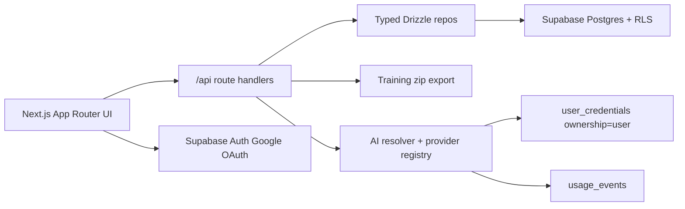

# Lexi

Lexi is a private cloud writing application for a writer whose workflow centers on line-by-line manual rewrites of AI-produced drafts. The MVP ships one core feature, the Rewrite Strip, so selected prose can be replaced in a focused strip while the original remains locked and visible.

The application also captures style-learning data in the background. Preferences, exemplars, and before/after rewrite pairs form a Style Profile that is ready for future AI transforms, hosted model access, agent workflows, and multi-user SaaS without changing the core schema.

## Architecture



## Quickstart

1. Create a Supabase project.
2. Enable Google OAuth in Supabase Auth and add your Vercel/local callback URL: `/auth/callback`.
3. Apply `supabase/migrations/0001_init.sql` with `supabase db push` or `psql`.
4. Copy `.env.example` to `.env.local` and fill `NEXT_PUBLIC_SUPABASE_URL`, `NEXT_PUBLIC_SUPABASE_ANON_KEY`, `NEXT_PUBLIC_APP_URL`, and `DATABASE_URL`.
5. Set the same env vars in Vercel.
6. Connect `https://github.com/soltraveler-sri/lexi` to Vercel and deploy.

## Local Development

```bash
pnpm install
cp .env.example .env.local
pnpm dev
```

## Add A Transform

Transforms are declared in `src/lib/transforms/types.ts` and registered in `src/lib/transforms/registry.ts`. The Rewrite Strip implementation is the reference transform in `src/lib/transforms/rewrite.ts`.

Keep transform data pure: selection, document text, document type, voice context, and user id are passed through `TransformContext`. UI transforms should delegate to editor/controller code and return a `TransformResult` only after the user commits.

Every committed transform that changes prose should seed a style event with before/after text and context so the Style Profile stays useful.

## Add An AI Provider

Provider contracts live in `src/lib/ai/types.ts`. The resolver loads BYOK credentials from `user_credentials`, instantiates the provider factory, and wraps successful calls with `recordUsageEvent()`.

Use `src/lib/ai/providers/anthropic.ts` as the scaffold for real providers. Anthropic cached system blocks are wired with `cacheControl: { type: "ephemeral" }`; OpenAI follows the same interface without cache-specific metadata.

## Add A Renderer Mode

Rewrite rendering is shared through `RewriteStripProvider` in `src/components/editor/extensions/RewriteStrip/controller.tsx`. A new mode should consume the same session state and call the same `commit`, `cancel`, and `setAutoAdvance` actions.

Use `InlineStripRenderer.tsx` as the feature-complete reference. `SidePanelRenderer.tsx` and `OverlayModalRenderer.tsx` show how to attach alternate UI while keeping the data path identical.

## Data Model

- `projects`: optional organization buckets for documents.
- `documents`: TipTap JSON documents with type, voice context, tags, and style-profile inclusion.
- `document_snapshots`: periodic edit snapshots.
- `style_events`: rewrite and AI suggestion before/after pairs.
- `exemplars`: user-marked source passages.
- `style_preferences`: freeform voice guidance.
- `voice_profiles`: compiled prompt cache by user and scope.
- `user_credentials`: BYOK and future hosted credentials, split by `ownership`.
- `user_settings`: renderer mode, spotlight, toast, and voice-profile toggles.
- `usage_events`: token/cost ledger for BYOK and hosted AI calls.

## AI + Billing Architecture

MVP UI does not invoke real AI. The plumbing is still present: `resolveProviderForUser()` chooses a default BYOK credential, returns a stub if none exists, and records usage for successful calls.

`user_credentials.ownership` supports `user` for BYOK and reserves `app` for a future hosted/metered tier. Both paths write to `usage_events`, so billing, metering, and cost views can be added without changing call sites.

Voice Profile tiering is implemented in `compileVoiceProfile()`. Light calls use preferences only. Heavy calls include preferences, five exemplars, and fifteen edit pairs. When `always_send_full_voice_profile` is enabled, light calls are upgraded into cacheable full-profile system blocks for prompt caching.

## Security Notes

Every application table has `user_id`, indexes on `user_id`, and RLS policies enforcing `auth.uid() = user_id` for select, insert, update, and delete.

Supabase Auth is Google OAuth only. `user_credentials.api_key` is plaintext in the MVP so BYOK management is live; KMS encryption is the first security TODO before broader access.

## Roadmap

- Wire real AI transforms against the provider registry.
- Add hosted/metered AI credentials with billing.
- Add multi-user team/workspace membership.
- Add agent workflows over drafts and style-profile data.
- Encrypt `user_credentials.api_key`.
- Add focused integration tests for auth, RLS, export, and rewrite capture.
